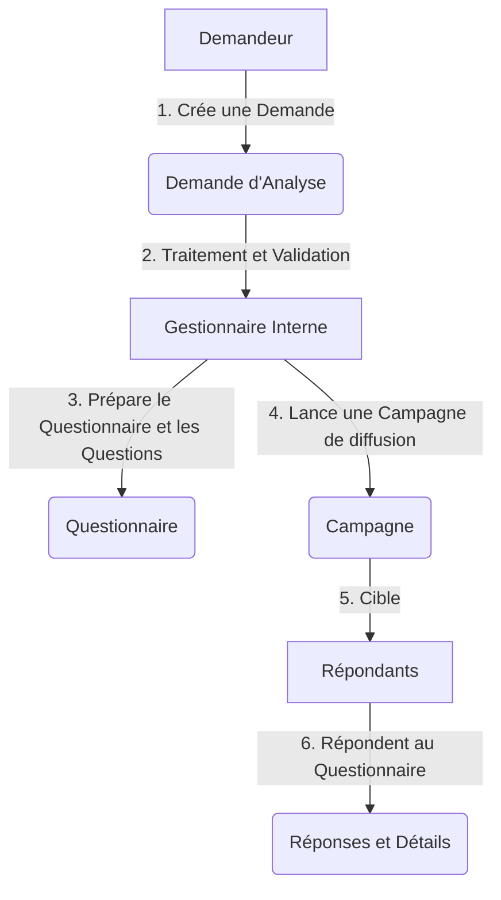

# Cahier des Charges - Application de Questionnaires

Ce document décrit les besoins fonctionnels et le modèle de données préliminaire pour l'application de gestion de questionnaires.

---

## 1. Description du Besoin

L'objectif est de concevoir un système de questionnaires structuré autour de trois rôles d'utilisateurs distincts, permettant de soumettre des demandes, de concevoir des questionnaires, de planifier des campagnes de diffusion et de collecter les réponses.

### Rôles d'Utilisateurs
1. **Les Demandeurs (Externes ou Métiers)** : Personnes à l'origine d'un besoin d'analyse. Ils formulent une demande d'analyse décrivant ce qu'ils souhaitent mesurer ou collecter.
2. **Les Gestionnaires Internes (Administrateurs ou Concepteurs)** : Utilisateurs qui reçoivent les demandes d'analyses, les valident, créent ou sélectionnent les questionnaires correspondants (conception des questions et des options) et publient ces questionnaires sous forme de **Campagnes** destinées aux répondants.
3. **Les Répondants (Autres Utilisateurs ou Public)** : Utilisateurs ciblés par les campagnes qui remplissent les questionnaires et soumettent leurs réponses.

---

## 2. Processus Fonctionnel

1. **Demande** : Un *Demandeur* soumet une demande d'analyse via un formulaire simple.
2. **Conception** : Un *Gestionnaire Interne* étudie la demande. S'il l'approuve, il prépare le questionnaire en y ajoutant des questions de différents types (texte libre, choix multiples, évaluation, etc.) ou en réutilisant un questionnaire existant.
3. **Campagne** : Le *Gestionnaire Interne* publie le questionnaire en définissant une *Campagne (durée de validité, utilisateurs ciblés)*.
4. **Collecte** : Les *Répondants* reçoivent le questionnaire de la campagne et soumettent leurs réponses, qui sont enregistrées et consolidées pour analyse.

---

## 3. Nomenclature

Tous les symboles techniques respectent les règles suivantes :
* **Tables** : Mots capitalisés pouvant contenir des espaces pour séparer les mots (exemple : Choix Possibles).
* **Colonnes** : Mots capitalisés accolés sans espace ni caractère de soulignement (exemple : IdentifiantDemandeur).
* **Langue** : Usage exclusif du français, sans accents dans les identifiants techniques pour préserver la compatibilité informatique.
* **Types de données** : Nombre, Texte, Date, Booléen.
* **Format des dates** : Toutes les dates doivent être stockées au format ISO 8601 (`YYYY-MM-DD` pour une date, `YYYY-MM-DDTHH:mm:ss` pour une date et heure).

---

## 4. Modèle de Données

### A. Table : Utilisateurs
Gère l'ensemble des acteurs du système avec leurs rôles respectifs.

| Nom | Type | Commentaire |
| :--- | :--- | :--- |
| Identifiant | Texte | Identifiant unique de l'utilisateur |
| Nom | Texte | Nom complet de l'utilisateur |
| Email | Texte | Adresse électronique |
| Photo | Texte | URL, chemin ou référence de la photo de profil |
| Role | Texte | Rôle attribué (Demandeur, Interne, Repondant) |

### B. Table : Demandes Analyses
Enregistre les requêtes initiales d'analyses des demandeurs.

| Nom | Type | Commentaire |
| :--- | :--- | :--- |
| Identifiant | Texte | Identifiant unique de la demande d'analyse |
| Titre | Texte | Titre ou objet de la demande |
| Description | Texte | Description détaillée du besoin d'analyse |
| Statut | Texte | État de la demande (EnAttente, Approuve, Rejete) |
| IdentifiantDemandeur | Texte | Référence à l'utilisateur demandeur |
| DateDemande | Date | Date de création de la demande au format ISO 8601 (`YYYY-MM-DD`) |

### C. Table : Questionnaires
Modélise la structure globale d'un questionnaire validé.

| Nom | Type | Commentaire |
| :--- | :--- | :--- |
| Identifiant | Texte | Identifiant unique du questionnaire |
| Titre | Texte | Titre général du questionnaire |
| Description | Texte | Consignes ou description générale |
| Statut | Texte | État du questionnaire (Brouillon, Actif, Archive) |
| IdentifiantConcepteur | Texte | Référence au gestionnaire interne concepteur |
| DateCreation | Date | Date de création du questionnaire au format ISO 8601 (`YYYY-MM-DD`) |

### D. Table : Questions
Définit les questions associées à un questionnaire.

| Nom | Type | Commentaire |
| :--- | :--- | :--- |
| Identifiant | Texte | Identifiant unique de la question |
| IdentifiantQuestionnaire | Texte | Référence au questionnaire associé |
| Intitule | Texte | Libellé de la question posée |
| TypeReponse | Texte | Format attendu (Texte, ChoixUnique, ChoixMultiples, Note) |
| OrdreAffichage | Nombre | Position de la question dans l'affichage |
| EstObligatoire | Booléen | Indique si le champ est obligatoire |

### E. Table : Choix Possibles
Pour les questions de type choix multiple ou unique, liste les options possibles de réponse.

| Nom | Type | Commentaire |
| :--- | :--- | :--- |
| Identifiant | Texte | Identifiant unique du choix |
| IdentifiantQuestion | Texte | Référence à la question concernée |
| ValeurOption | Texte | Texte du choix de réponse |
| Ordre | Nombre | Position du choix dans la liste |

### F. Table : Campagnes
Permet la diffusion d'un questionnaire sur une période donnée à une liste de destinataires.

| Nom | Type | Commentaire |
| :--- | :--- | :--- |
| Identifiant | Texte | Identifiant unique de la campagne |
| IdentifiantQuestionnaire | Texte | Référence au questionnaire diffusé |
| TitreCampagne | Texte | Titre ou description de la campagne |
| DateDebut | Date | Date d'activation de la campagne au format ISO 8601 (`YYYY-MM-DD`) |
| DateFin | Date | Date de clôture de la campagne au format ISO 8601 (`YYYY-MM-DD`) |
| Statut | Texte | État de la campagne (Planifiee, EnCours, Terminee) |

### G. Table : Réponses
Représente la soumission globale des réponses d'un utilisateur pour une campagne donnée.

| Nom | Type | Commentaire |
| :--- | :--- | :--- |
| Identifiant | Texte | Identifiant unique de la réponse globale |
| IdentifiantCampagne | Texte | Référence à la campagne concernée |
| IdentifiantRepondant | Texte | Référence à l'utilisateur répondant |
| DateReponse | Date | Date et heure de validation des réponses au format ISO 8601 (`YYYY-MM-DDTHH:mm:ss`) |

### H. Table : Details Réponses
Stocke la réponse individuelle apportée par un répondant à une question précise.

| Nom | Type | Commentaire |
| :--- | :--- | :--- |
| Identifiant | Texte | Identifiant unique du détail de la réponse |
| IdentifiantReponse | Texte | Référence à la réponse globale |
| IdentifiantQuestion | Texte | Référence à la question concernée |
| ValeurReponse | Texte | Saisie de l'utilisateur ou identifiant du choix possible |
